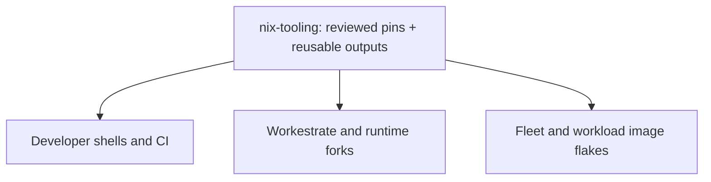

<h1 align="center">nix-tooling</h1>

<strong>Our tooling pins. Shared across our projects.</strong>

A common foundation for development, builds and reusable guest images at rybskiworks.

  
  &nbsp; Internal tooling &nbsp; | &nbsp; x86_64-linux &nbsp; | &nbsp; Nix flakes

  <a href="#why-this-repo-exists">Why</a> &middot;
  <a href="#what-we-share">What we share</a> &middot;
  <a href="README.agents.md">Consumer integration</a> &middot;
  <a href="CONTRIBUTING.md">Working on nix-tooling</a>

---

**This is the internal tooling and pinning repository for rybskiworks.** It is
publicly visible, but designed around our own repositories, not as a general-purpose
Nix framework. Workestrate, runtime forks, fleets and workload image flakes can
consume a reviewed tooling revision instead of maintaining parallel toolchain pins
and packaging recipes.

## Why this repo exists

We want to **build the shared pieces once and reuse them wherever the inputs
match**, rather than repeatedly download or compile slightly different copies.

Shared inputs and package outputs help consumers converge on the same Nix store
paths. Those paths can be reused from the local store or substituted from a trusted
binary cache. Shared guest parents also let workload images inherit common layers
instead of rebuilding their base independently.

**Pinning enables reuse; it does not guarantee a cache hit.** Matching version
strings are not enough: package definitions, source, system, dependencies and build
options matter too. Cross-machine reuse also needs the matching outputs published
to a reachable, trusted cache. This repository provides building blocks, not an
automatically deployed cache or builder service.

## What we share

| Shared here | What it gives our projects |
| :--- | :--- |
| **Input revisions** | One authority for nixpkgs, Fenix/Rust, devenv, flake-parts, treefmt-nix and git-hooks. |
| **Packaged tools** | Reusable outputs for Tombi, Beads, Lix, Determinate clients and Dolt variants. |
| **Opt-in development modules** | Common shell tools, Nix/TOML/Rust formatting and checks, without a mandatory all-in-one environment. |
| **Guest building blocks** | Image constructors, NixOS profiles and shared Lix/Determinate parent images for consumer-owned leaves. |
| **Cache clients** | Explicit, additive cache endpoint/public-key configuration, including the pinned devenv cache. |
| **Human co-author attribution** | Shared trailer formatting, validation and opt-in clone hooks; [usage and squash workflow](docs/git-attribution.md). |

The exported platform is **`x86_64-linux`**. The authoritative output names are in
[`flake.nix`](flake.nix); the [consumer guide](README.agents.md#choose-the-smallest-surface)
maps them to integration tasks.

## What stays in the consuming repo

**nix-tooling owns shared tooling. Each consumer owns its application and policy.**
That includes source and dependency locks, project-specific tests and schemas,
workload composition, deployment choices, credentials and runtime state.

A tooling update should not silently become a host-daemon replacement, tracker
migration or workload launch. Different repositories can advance their tooling
pins at different times; alignment is deliberate, not an automatic rollout.

To adopt or update it: select a reviewed revision, consume its inputs/outputs,
validate the affected consumer and review the pin plus lockfile change. The exact
wiring, local overrides and caveats belong in [README.agents.md](README.agents.md),
which is useful to both developers and coding agents integrating another repo.

## Find the right guide

| Task | Start here |
| :--- | :--- |
| Wire a project into the shared pins and outputs | [Consumer integration](README.agents.md) |
| Build a guest or extend a shared parent | [Guest primitives](docs/guest-images.md), [NixOS images and layers](docs/nixos-oci-images.md) |
| Select a guest engine | [Lix guests](docs/lix-guests.md), [Determinate guests](docs/determinate-guests.md) |
| Reuse Lix and secret delivery on a host | [Shared Lix module](docs/lix-guests.md#package-and-module-ownership), [SOPS modules](docs/sops.md) |
| Share immutable package closures with guests | [External closures](docs/external-closures.md) |
| Configure cache substitution | [Signed cache clients](docs/cache-clients.md) |
| Use the Beads SQL service | [Service configuration and compatibility](docs/beads-server.md) |
| Edit, test or promote nix-tooling | [Contributing](CONTRIBUTING.md), [CI and downstream promotion](docs/ci-releases.md) |

For interactive work **on this repository**, run `./scripts/devenv-shell.sh`.
It supplies the development root required by the pinned devenv integration.
Verification commands and their limits are in the CI guide, not implied by shell
entry or the badge above.

Shared-store generations and the per-fleet cache/builder plane are tracked in
[#15](https://github.com/rybskiworks/nix-tooling/issues/15) and
[#19](https://github.com/rybskiworks/nix-tooling/issues/19). Those proposals are not
promises that the runtime integrations are available in a consumer's pinned revision.

[Security](SECURITY.md) &middot; [Governance](docs/github-governance.md) &middot;
[Repository audit and outstanding license decision](docs/repository-audit-2026-09-11.md)
